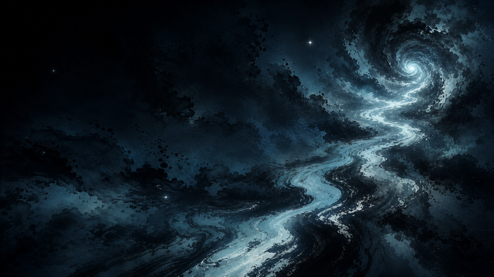
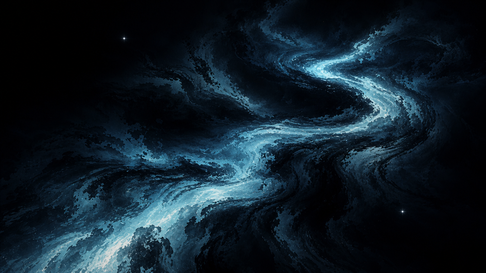
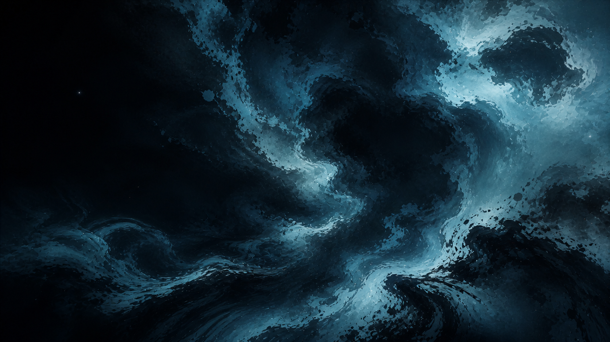
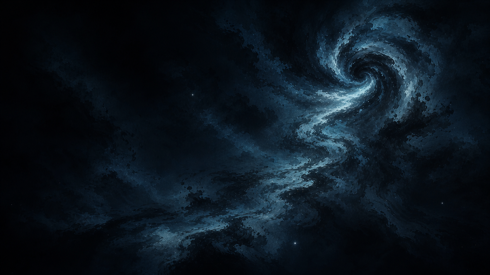

# 沉浸式东方水墨宇宙设计规格

日期：2026-07-11  
项目：`Robin-fang611/super-individual-homepage`  
状态：设计已确认，等待实施计划确认

## 1. 目标

把现有个人主页从“围绕焦点旋转、以静态主视觉为背景的 Three.js 星路场景”升级为一个完整、无破绽、可自由飞行的第一人称三维宇宙。

用户进入页面后，先经历约 3–4.5 秒的自动飞入；随后无需点击按钮，触控板控制权平滑交给用户。用户可以在球形可航行空间内自由移动、观察任意方向，并在接近边界时沿球面继续滑行，但永远不能看见或穿过世界外壳。

这个阶段只建设三项基础能力：

1. 三维宇宙基础引擎：第一人称相机、触控板、键盘辅助、运动、自动入场、球形软边界。
2. 自适应画质系统：四档质量、帧时间闭环、渐进加载、五秒可交互。
3. 宇宙视觉系统：空间化东方水墨、主墨河、墨旋、墨云、深空留白和克制光影。

个人介绍、作品内容、阅读界面、音频和移动端体验不在本阶段范围内，但现有内容系统不能因底层重建而被无谓破坏。

## 2. 成功标准

- 冷缓存、4 Mbps 下行和约 80 ms RTT 的测试条件下，静态首屏约 2.5 秒内出现，首个稳定 WebGL 画面约 3.5 秒内出现，5 秒内可控制。
- Mac Safari、Mac Chrome、Windows Chrome、Windows Edge 使用真实触控板完成主要控制流程。
- 用户可以连续观察完整球面方向，不存在 `±89°` 硬限制、极点锁死或方向突变。
- 玩家可以到达球体内部不同象限；接近边界时向外速度渐进降低，向内与切向运动保持自然，任何帧率下都不能穿出。
- 360 度观察和持续飞行时，看不到球壳、经纬线接缝、极点、卡片侧面或世界终止面。
- Performance、Balanced、High、Cinematic 四档保持同一世界、同一地标、同一构图和同一色彩语义。
- 自动档尽量维持接近 60 FPS；不得长期低于 30 FPS；紧急降档后 4 秒内恢复稳定。
- 视觉主体必须是青蓝黑的空间化水墨体量，粒子仅作为极少数银色星芒和飞白碎点。

## 3. 已排除方案

### 3.1 继续改造现有 Orbit 模型

不采用。现有 `focus + yaw/pitch/distance + lookAt()` 的焦点环绕模型与第一人称自由飞行在状态语义上冲突。继续修补会让相机、惯性、自动入场和边界互相争夺控制权。

### 3.2 引入通用物理引擎

不采用。本阶段只有一个球形外边界，没有刚体、复杂碰撞和物理交互。引入 Cannon、Rapier 等依赖会增加包体与调试复杂度，却不能显著改善结果。

### 3.3 全场景体积光线步进

不作为基础架构。它会同时放大弱 GPU、Safari、发热、显存和五秒首屏风险。局部体积效果只在允许的画质档位内启用，低档必须有同构的低成本替代。

## 4. 总体架构

单一 `UniverseRuntime` 持有唯一的渲染循环和生命周期。每帧执行顺序固定为：

```text
收集输入
  → 更新体验状态
  → 固定步长运动模拟
  → 球形边界约束
  → 更新世界可见内容与 LOD
  → 更新质量控制器
  → 渲染
```

核心组件：

- `UniverseRuntime`：唯一 RAF、暂停、恢复、销毁和错误边界。
- `ExperienceStateMachine`：管理加载、自动入场、交权、自由飞行、浮层暂停、页面挂起和错误状态。
- `PlayerRig`：相机位置、四元数朝向、线速度和角速度的唯一真源。
- `InputRouter`：把浏览器事件归一为设备无关的输入帧，不直接改相机。
- `FlightController`：把输入转换为期望速度和角速度。
- `KinematicIntegrator`：固定步长积分、加速、阻尼、速度上限和静止吸附。
- `SphericalBoundary`：纯数学软边界和最终不可越界约束。
- `IntroFlightController`：产生自动入场轨迹和交权混合，不直接拥有相机对象。
- `WorldBlueprint`：固定世界种子、地标坐标、色彩参数和各质量档共享的空间语义。
- `SceneWorld`：远景、中景、近景与光学层，只读取玩家姿态和质量配置。
- `QualityController`：自动/手动模式、当前档位、动态分辨率、升降档防抖和安全阀。
- `FrameMonitor`：采集有效帧的 p50、p95、长帧和掉帧率。
- `AssetTierLoader`：按 `core → balanced → high → cinematic` 增量加载资源。
- `CapabilityGuard`：只判断 WebGL 能力是否支持某项效果，不用 GPU 型号猜性能。

外部接口继续提供 `pause()`、`resume()`、`getSnapshot()` 和 `destroy()`，降低对现有 `app.mjs` 的影响。

## 5. 第一人称飞行

### 5.1 坐标与姿态

- 世界中心为 `(0, 0, 0)`。
- 相机作为 `PlayerRig` 子节点，局部位置和旋转保持归零。
- 世界固定，移动玩家；不移动整个宇宙伪造飞行。
- 朝向完全使用四元数，允许视线连续越过头顶、脚下和任意球面方向。
- 不设置 pitch 硬限制，也不在活动输入期间强制固定世界上方。
- 用户不直接控制 roll。系统维护一个连续传输的“舒适参考框架”，只在没有观察输入时缓慢消除意外累积的画面滚转；该过程不得改变视线方向，不得产生跳变，也不得阻止完整球面观察。
- 当前阶段不提供飞船式主动翻滚。主动六自由度翻滚属于未来独立模式。

### 5.2 输入语义

| 输入 | 行为 |
|---|---|
| 双指左右 | 连续改变水平观察方向 |
| 双指上下 | 连续改变垂直观察方向，可越过顶部和底部 |
| 触控板捏合 | 沿当前视线前进或后退 |
| W / S | 沿当前视线前进或后退 |
| A / D | 沿相机局部左右平移 |
| Space / E | 沿舒适参考框架的上方移动 |
| Shift / Q | 沿舒适参考框架的下方移动 |

键盘使用 `KeyboardEvent.code`，避免键盘布局差异。多轴输入先归一化，斜向速度不能超过单轴速度。

`InputRouter` 输出：

```text
InputFrame
- lookX
- lookY
- moveRight
- moveForward
- moveUp
- thrust
- source
- timestamp
- controlActive
```

Wheel 事件先按 `deltaMode` 归一为像素量，再做异常值限幅。未修饰的 `deltaX/deltaY` 映射观察；`ctrlKey + wheel` 作为触控板捏合的主要浏览器信号。Safari 与 Chromium 的符号和惯性尾段差异只在平台适配层校准。

控制激活时监听器必须允许 `preventDefault()`，阻止页面滚动、浏览器缩放和 Space 滚屏。浮层、输入框、页面失焦或控制未激活时恢复浏览器默认行为，并清空所有持续输入。

普通鼠标滚轮、鼠标拖拽、手机和平板不属于本阶段验收范围。

### 5.3 运动模型

模拟使用固定 `1/120s` 或 `1/60s` 步长；渲染帧只负责累积时间。单帧补算时间和步数设上限，避免标签页恢复后一次性跨越世界。

速度使用指数趋近：有输入时平滑接近期望速度，无输入时平滑接近零。释放输入后约 `0.6–1.2s` 降到最大速度的 1% 以下，低于静止阈值后直接归零。

浏览器触控板的惯性尾段和项目阻尼不能形成两套长惯性。输入适配层需要用真实设备标定尾段，项目自身惯性保持短而可控。

## 6. 球形软边界

可飞行半径 `Rplay` 必须小于视觉世界半径 `Rvisual`，两者之间保留相机近裁剪、视觉淡化和内容调度所需的安全壳。

软边界从约 `0.85 × Rplay` 开始。设玩家相对中心的位置为 `x`，径向单位向量为 `n`，速度为 `v`。把速度分成：

```text
向外分量 vr = dot(v, n)
切向分量 vt = v - vr * n
```

只有 `vr > 0` 时才按剩余距离的平滑函数逐渐衰减向外分量；切向分量完整保留，向内分量不受影响。因此玩家越接近边界越难继续向外，但仍能沿球面自然滑行。

每个固定步先预测运动线段。如果线段与球面相交：

1. 移动到首次交点内侧的安全距离；
2. 删除碰撞后的朝外速度；
3. 使用剩余时间继续积分切向运动；
4. 最后投影回 `Rplay - epsilon` 内，作为数值安全网。

硬性不变量：

```text
distance(player, center) <= Rplay - epsilon
```

边界不显示玻璃球、光墙或球面纹理。视觉上最多增加极弱的青黑深雾，且不能让用户察觉球面弧度。

## 7. 自动入场与状态流

```text
BOOT
  → LOADING
  → INTRO_AUTOPILOT
  → HANDOFF_BLEND
  → ACTIVE
  ↔ PAUSED_OVERLAY
  ↔ SUSPENDED
  → DISPOSED

任意运行状态 → ERROR
```

- 自动飞入约 `3–4.5s`。
- 最后 `0.3–0.5s` 自动轨迹权重从 1 降到 0，玩家输入权重从 0 升到 1。
- 玩家提前操作时缩短交权，不忽略输入。
- 交权从当前真实姿态和速度初始化，不能重建为预设角度。
- 自动飞行末端速度平滑传递或归零，不能在交权帧突然丢失。
- 现有 CSS intro 必须由同一状态机触发，不能继续独立计时。
- `prefers-reduced-motion` 和跳过入场走同一交权路径。

任何一帧只能有一个模块写入 `PlayerRig`。

## 8. 自适应画质

### 8.1 四档配置

| 项目 | Performance | Balanced | High | Cinematic |
|---|---:|---:|---:|---:|
| DPR 上限 | 1.0 | 1.25 | 1.5 | 2.0 |
| 档内渲染比例 | 0.70–1.0 | 0.80–1.0 | 0.85–1.0 | 0.90–1.0 |
| 抗锯齿 | FXAA | FXAA / 轻量 SMAA | SMAA | SMAA，静止后允许累积增强 |
| 水墨体积 | 深度雾片 | 低步数局部体积或多层雾片 | 中步数局部体积 | 高步数局部体积 |
| 星光与飞白碎点 | 基准的约 20% | 约 45% | 约 75% | 100% |
| 后期 | 色调映射 | 低分辨率辉光 | 半分辨率辉光与 LUT | 更高分辨率辉光与局部增强 |
| 视距系数 | 0.55 | 0.75 | 1.0 | 1.2 |
| GPU 常驻资源建议上限 | 96 MiB | 160 MiB | 256 MiB | 384 MiB |

粒子数量只是成本参数，不是画面主体。低档优先降低体积采样、内部渲染比例和雾层数量，不得先删除主墨河、墨旋或主要墨云。

WebGL 上下文创建时关闭固定 MSAA，改用可切换的后期抗锯齿。粒子和飞白碎点使用固定最大缓冲区，通过实例数量调整，避免切档时重新分配。

### 8.2 帧时间闭环

- 启动忽略前 15 个渲染帧。
- 初始窗口为 45–60 个有效帧。
- 稳态窗口约 120 个有效帧，每秒评估一次。
- 页面隐藏、首次 shader 编译和明确标记的资源上传期间暂停质量评分，但单独记录体验卡顿。
- 从 Balanced 或同像素区间的历史稳定档开始，仍需重新验证。
- 启动阶段若 p95 超过约 22 ms 或掉帧率超过 8%，降到 Performance。
- 连续 5 帧超过 33 ms 或 p95 超过 40 ms，立即降一档。
- 一般压力先每两秒降低 0.05 档内渲染比例；到达下限仍不稳定，再整档降低。
- 升档要求当前档稳定至少 20 秒、连续多个窗口通过，并且只试探相邻档。
- 降档后 30 秒禁止升级，升级失败后 60 秒不再试同一档。
- 原则为快速降、缓慢升、相邻档试探。

手动档位保存在浏览器本地。手动模式不被普通自适应覆盖，但连续 10 帧超过 50 ms 时允许临时降低内部渲染比例，防止浏览器失去响应。

### 8.3 五秒启动与资源预算

```text
0–0.3s   HTML/CSS 静态墨色首屏
0.3–1.2s 加载 Three.js 核心、设置和 core 资源
1.0–2.5s 绘制第一帧，预热必要 shader
1.5–4.5s 自动飞入，同时做候选档压力测试
3–5s     提交稳定档，开放控制
5s 后    后台补齐该档资源并短交叉渐变替换
```

关键资源预算：

- HTML、关键 CSS、启动 JS：压缩后不超过约 200 KiB。
- Three.js、页面逻辑、低档 shader：不超过约 450 KiB。
- 首帧纹理、低 LOD 和必要字体：不超过约 550 KiB。
- 首五秒总传输目标不超过 1.2 MiB，硬上限 1.5 MiB。
- 关键请求不超过 20 个，单个关键资源不超过 400 KiB。
- Balanced 累计资源约 4 MiB，High 约 8 MiB，Cinematic 约 15 MiB。

高档资源失败、超时或尚未完成时不得阻塞交互。静态站和 CDN 足够承载；服务器不承担实时渲染。

## 9. 空间化东方水墨视觉

### 9.1 美术母版

本阶段的唯一风格基准：



固定语言：

- 主色为黑、青黑、靛蓝、神秘青色和冷银色。
- 不使用紫色或洋红作为主色或第二主色。
- 画面体量来自墨色晕染、湿墨边缘、飞白、烟雾状密度和书法式流动路径。
- 粒子感极弱，只保留极少数银色星芒和飞白碎点。
- 炫光、体积光和 Bloom 必须克制，只出现在墨层变薄或银光集中的局部。
- 东方武侠气质来自路径、疏密、回旋、留白和气韵，不依赖人物、建筑、山水或纸张背景。

### 9.2 视觉分层

1. **方向性墨色深空**：近黑青蓝底色和极弱大尺度墨迹，只随视角旋转，不随平移；不出现星点墙。
2. **远景地标**：固定的主墨河总体走向和偏轴墨旋，提供方向记忆。
3. **中景墨域**：有限数量的水墨星云、墨团、墨河分支和少量银色星团，提供真实视差。
4. **近景介质**：极薄墨雾、飞白碎片和极少银色星芒，承担速度与尺度，不得像下雪。
5. **光学统一**：受控曝光、冷银青辉光、轻雾化和统一 LUT。
6. **LOD 调度**：相机周围分区维护可见内容，地标不变，只替换表现成本。

约 55%–65% 的视域保持青黑留白。暖色不再作为常规点缀；如后续需要，只能以极低比例进行单点节奏测试。

### 9.3 主墨河

参考：



主墨河由三部分组成：

- 三维空间曲线决定书法式走向、粗细、停顿和回旋。
- 椭圆截面的密度场形成青黑湿墨、银青内光和可穿入的体积。
- 多尺度噪声和流场形成晕染边缘、飞白断口和暗部涡流。

高档使用低频体积密度、局部光照和少量碎点；低档使用多层不同深度的墨带与雾片。四档共享骨架、宽度轮廓、亮暗节奏和空间坐标。

### 9.4 水墨星云

参考：



星云只存在于有限墨域，不用连续浓雾填满世界。每个墨域由不同尺度、方向和种子的三维密度组合，形成湿墨扩散、干笔裂口和层层渗化。

- Cinematic / High：局部体积采样和低强度内部透光。
- Balanced：低步数体积或三到五层深度雾片。
- Performance：柔和深度替身、解析雾和少量真实近景墨丝。

用户进入墨域时必须仍能辨认前后层次和出口，不能因为黑雾遮满屏幕而失去方向。

### 9.5 墨旋地标

参考：



墨旋位于偏轴远方，由非对称墨流与暗中心构成。它不是标准银河盘、黑洞吸积盘或可进入传送门。所有质量档保持相同旋向、倾角、视觉尺寸和空间方位。

高档增加局部体积层、缓慢流场和受控银青内光；低档使用有深度的预渲染主体与少量动态墨丝。

### 9.6 防穿帮

- 不用单张等距柱状全景图包裹球内壁。
- 远景采用无缝方向采样或程序化墨底；只随旋转，不随平移。
- 中近景是真实空间内容，提供差异化视差。
- 可航行范围与视觉内容终点之间保留安全缓冲和多层稀薄墨雾。
- 卡片类替身在能看到侧面之前淡出；靠近相机时尺寸和透明度柔和衰减。
- 噪声、墨片和碎点使用不同种子、尺度、旋转与畸变，避免 UV 平铺和网格重复。
- LOD 使用双阈值滞回和 `0.3–1s` 交叉淡化。
- 透明层优先使用稳定的加权混合；不支持时使用深度分桶、预乘 Alpha 和抖动淡化。
- 大型墨域避免大范围互相嵌套，防止透明排序错误和过曝。

## 10. 错误与降级

- WebGL 初始化失败：保留静态水墨首屏和基础页面内容，不显示白屏。
- WebGL context lost：暂停输入和动画，尝试以 Performance 重建；失败则回到静态首屏。
- 高档资源失败：保持当前低成本替身，记录失败，不阻塞控制。
- shader 编译失败：关闭对应增强效果并回退相邻实现。
- 页面失焦或隐藏：暂停模拟和质量评分，清空按键与手势状态。
- 帧间隔过大：限制累计时间和补算步数，最终边界投影保证不穿墙。
- 用户开启浮层：暂停飞行输入，关闭后不继承旧输入。

## 11. 测试策略

### 11.1 数学与状态单测

- 随机化至少一万组位置、速度和大时间步，积分后不得越界、出现 NaN 或速度爆炸。
- 越接近边界，朝外速度单调降低；朝内速度不受影响；切向速度在容差内保持。
- 在边界处沿切线运动可持续滑行，不被吸向中心。
- 同一输入在 30、60、120 Hz 模拟下终点差异小于世界半径的 0.1%–0.5%。
- intro、handoff、active、paused、suspended 和 error 状态转换只有一个相机写入者。
- 交权位置跳变量小于 `0.001R`，朝向跳变小于 `0.1°`，速度尖峰不超过约 10%。

### 11.2 输入验收

- 双指左右和上下只改变观察，不改变位置。
- 上下观察可连续越过顶部与底部，没有锁死、突然反向或画面跳转。
- 捏合两个方向分别映射前进和后退。
- WASD、Space/Shift、Q/E 组合方向正确，无斜向加速。
- blur、visibilitychange 和浮层打开后，持续输入全部归零。
- 控制激活时页面不滚动、不缩放；退出控制后恢复默认行为。
- Mac Safari、Mac Chrome、Windows Chrome、Windows Edge 必须真机触控板测试，合成事件不能替代。

### 11.3 视觉验收

- 在至少 12 个观察点完成静止、完整球面观察和连续飞行，看不到球壳、极点、接缝或终止面。
- 沿至少三条往返航线，不出现可辨识的墨云重复、纹理周期或碎点网格。
- 穿过墨河、墨云和近景墨丝时，看不到卡片侧面、近裁硬切、黑边或透明顺序突变。
- 四档固定机位的主墨河、墨旋和主要墨域位置偏差不超过画面宽高的约 2%。
- 四档保持青蓝黑银色彩语义，紫色不得成为第二主色。
- 静止画面有大面积留白；运动画面能感受速度，但没有粒子雨雪感。

### 11.4 性能与加载验收

- 代表设备至少覆盖 Intel Mac、Apple Silicon Mac、Windows 集显和 Windows 中端独显。
- 冷缓存与热缓存分别测试；冷缓存模拟 4 Mbps 和约 80 ms RTT。
- 静态首屏约 2.5 秒内出现，稳定 WebGL 首帧约 3.5 秒内出现，5 秒内可控制。
- 首五秒关键传输不超过 1.5 MiB，TBT 目标不超过约 200 ms，不出现超过 150 ms 的单次主线程阻塞。
- 稳定后 p95 帧间隔目标不超过约 22 ms，紧急降档后 4 秒内恢复。
- 入场结束后 10 秒内最多再变档一次；稳定运行时每分钟最多一次。

## 12. 遥测与隐私

首版可以只在本地开发环境记录以下指标，不立即建设生产分析后台：

- shell paint、renderer ready、first canvas frame、interactive。
- p50、p95、p99 帧时间、掉帧率、档位、渲染比例和变档原因。
- 资源包字节、解码时间、缓存状态、加载失败、shader 异常和 context lost。

如果未来上传生产遥测，只允许聚合数据、临时会话 ID 和低比例采样；不记录原始输入轨迹，不用 GPU renderer 字符串做用户画像或质量选档。

## 13. 部署

项目继续保持静态部署。Cloudflare Pages 或同类静态托管加 CDN 足够完成 HTML、JavaScript、shader、纹理和模型的分发。实时 3D 渲染由访问者设备完成，服务器不需要 GPU 或高计算配置。

首版不引入 Service Worker，避免版本缓存错乱。带内容哈希的静态资源使用长期 immutable 缓存，HTML 使用重新验证。

## 14. 明确不做

- 鼠标交互体验承诺。
- 手机和平板适配。
- 飞船驾驶舱、主动 roll 或完整六自由度飞船模式。
- 内部物体碰撞；视觉墨域默认可穿越。
- 登录、多人、后台编辑器、数据库、AI 实时生成。
- 个人作品与内容节点的重新设计。
- 音效与背景音乐。
- 全场景体积 raymarch。

## 15. 主要风险

- 浏览器没有统一的“触控板”设备类型；必须依赖真实设备矩阵调参。
- Safari 边缘返回手势和捏合事件无法在所有场景中完全控制，需要实机验证和控制激活边界。
- 水墨体积若只依赖二维图片会显得像贴片；若全部使用高步数体积又会失去低配覆盖。必须坚持同构的高低成本双实现。
- 大量半透明墨层会产生排序错误和过曝，需控制叠层数量和亮度能量。
- 无限制球面观察可能积累画面 roll；舒适参考框架必须连续、缓慢、不可感知地稳定，不得重新引入硬限制。
- 自动画质若缺少滞回会频繁跳档；升级必须比降级更慢。
- 美术参考图不是可直接贴入世界的最终资源，实施阶段必须把它们拆解为密度、流场、雾层、颜色和光学参数。

## 16. 实施顺序约束

1. 先证明第一人称控制、完整球面观察、固定步长和球形边界成立。
2. 再建立画质配置、帧时间闭环和五秒渐进加载骨架。
3. 最后按“墨底 → 主墨河 → 墨旋 → 墨云 → 近景墨丝 → 光学统一”的顺序建设视觉。

任何视觉开发都不得绕过前两项基础；任何高档效果都必须同时定义低档替代和失败回退。
